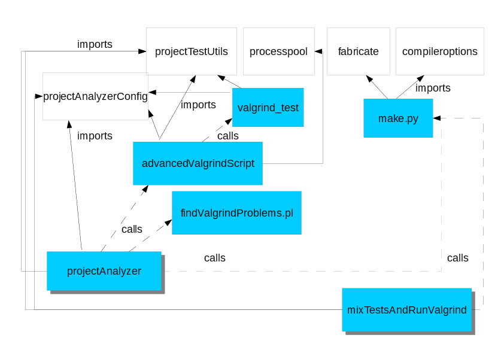

.. _sec-dev-tests:

*****
Tests
*****

Running the tests. Adding new tests to `allTests.cpp`
=====================================================

Adding a new test suite to the available tests
----------------------------------------------

As before, the available test suites are codified in the :file:`src/allTests.cpp` file. What changes is that, before, you used the `RUN_TEST()` macro, and you now must use the `ADD_TEST()` macro.

Building the executables
------------------------

To create the standard test runner, simply compile the serial, non-production version, and with the non-redistributable version (so as to exactly obtain the same numbers):

.. code-block:: console

  $ cmake -C /path/to/cmakconfig /path/to/PELE-1.5 -DUSE_MPI=OFF -DPRODUCTION=OFF -DBUILD_REDISTRIBUTABLE=OFF

To create the executable for the long tests:

.. code-block:: console

  $ cmake -C /path/to/cmakconfig /path/to/PELE-1.5 -DUSE_MPI=OFF -DPRODUCTION=OFF -DBUILD_REDISTRIBUTABLE=OFF -DRUN_LONG_TESTS=ON

The MPI tests simply require to compile the equivalent MPI version:

.. code-block:: console

  $ cmake -C /path/to/cmakconfig /path/to/PELE-1.5 -DUSE_MPI=ON -DPRODUCTION=OFF -DBUILD_REDISTRIBUTABLE=OFF

And last, for the OpenMP tests (which should be the same as the serial ones), the executable is built as follows:

.. code-block:: console

  $ cmake -C /path/to/cmakconfig /path/to/PELE-1.5 -DUSE_OPENMP=ON -DUSE_MPI=OFF -DPRODUCTION=OFF -DBUILD_REDISTRIBUTABLE=OFF

Options for running the tests
-----------------------------

All PELE builds create, except for Production, an executable that, by default, runs the test system.

When no arguments are provided, all the available tests for the PELE flavor (serial, MPI, OpenMP, etc.) are run. If the `--test-list-file` option is provided, only the test suites given in an input file are executed. You can get such an input file with all the available test suites for the PELE flavor using the `--write-test-list-file` option.

You must ALWAYS RUN TESTS FROM PELE'S TOP LEVEL DIRECTORY, since the tests include paths relative to that directory.

Here are the PELE command line options:

.. code-block:: console

    $ PELE-1.5 --help
    PELE version 1.5.0.${BUILD_TAG}
    PELE (Protein Energy Landscape Exploration)

    Copyright 2010-2014 BARCELONA SUPERCOMPUTING CENTER.

    See the COPYRIGHT file at the top-level directory of this distribution.

    Usage: "PELE-1.5_release" [options] [control-file]
    Generic options:
      --help                     produce help message
      --version                  program version

    Specific options:
      --control-file arg         Control file for the simulation.
      --test-list-file arg       File with the list of test suites to execute.
      --write-test-list-file arg Writes the list of available test suites to 
				 execute. This option is exclusive with others and 
				 takes precedence.

To run the MPI tests:

.. code-block:: console

  $ mpirun -np 2 Release_MPI/PELE-1.5 
  $ mpirun -np 4 Release_MPI/PELE-1.5

OpenMP and long tests (RUN_LONG_TESTS) binaries are executed as usual.

Getting a file with the list of all available test suites for the PELE flavor
-----------------------------------------------------------------------------

The following command will write in `all_tests.txt` all the available test suites for your PELE flavor (being it serial, MPI, OpenMP, etc.).

.. code-block:: console

  $ PELE-1.5 --write-test-list-file all_tests.txt

The contents of these file are like:

.. code-block:: text

    TestTest
    TestAtom
    TestRead
    TestLicense
    ...

This file admits one test suite name per line, it allows blank lines, and also comments with the sharp character (`#`), as long as it is the first non-blank character.

Running the test suites provided in a file
------------------------------------------

If you create a file with a list of test suites to run (see previous section), and you run PELE with that file, those test suites will get executed.

.. code-block:: console

  $ PELE-1.5 --test-list-file test_selection.txt

If all test suites listed in the file are actually available, the output will contain the following text at the end:

.. code-block:: console

  All requested test suites were matched to the available ones.

If not, a list of all the test suites not recognized will appear at the beginning of the output and also at the end, so that you can easily see which test suites were not executed because they were not recognized.

Energy comparison tests
=======================

To check the energy component values of PELE++ with previous PELE versions, including the Fortran one (PLOP), you can check the tests in the group's Dropbox folder :file:`PeleTests/PLOPEnergyComparison/`. See the :file:`README.txt` file there.

There is a report about those calculations in the document :file:`energy_differences.pdf` in the Dropbox folder :file:`Documents/`.

Of course, there are also automatic tests in the test suite that check the energy calculation.

Coverage
========

To actually being able to acces the coverage, PELE needs to be compiled with the **-DDEBUG=ON** option.
So, if for example when want to measue the short and long tests coverage, we should follow this steps:

.. code-block:: console

    We create a folder where we will compile PELE:
    $ mkdir short_coverage
    $ cd short_coverage
    
    We compile PELE with the proper flags:
    $ cmake -C <path_to_cmake_config> <path_to_source_code> -DUSE_MPI=OFF -DPRODUCTION=OFF -DDEBUG=ON
    $ make -j 4
    
    Now, we can run the binary (remember to run it from the source, so it can find Data and Documents)
    $ ./PELE-1.6 --license-directory <path_to_license>
    
    This will create the files .gcno and .gcda needed to get the coverage. It will be created where we compiled PELE. In this case, for example, in short_coverage/src/CMakeFiles/PELE-1.6.dir. Now, we need to gather the information with lcov, create the html and, if we want, exclude external libraries:
    $ cd short_coverage
    $ lcov --directory . -c -o coverage.info
    $ lcov -r coverage.info "<path_to_pele_dependencies>" "/usr*" -o coverage_cleaned.info
    $ genhtml coverage_cleaned.info --output-directory out 
    
Right now, the coverages are at:
**-Short tests: 83.7%**
**-Long tests: 84%**

Tests failing
=============

Here is the list of all currently failing tests, along with the error messages (July 2020).

Serial Short Tests
------------------

The following serial tests are currently failing:

.. code-block:: console
	Test TestPeleInVacuum has failed 1 times:
		- In function testCreatePeleSimulationTask
	
	1 out of 1397 tests have failed -> May be Problems!!!
	
Serial Long Tests
-----------------

The following serial long tests are currently failing:

.. code-block:: console
	Test TestSideChainPredictionAlgorithm has failed 2 times:
		- In function testZhexinSideChainAlgorithm
		- In function testZhexinSideChainAlgorithm
	
	Test TestTNWithSgbAndFrozenAtoms has failed 3 times:
		- In function testTruncatedNewtonInSgb
		- In function testTruncatedNewtonInSgb
		- In function testTruncatedNewtonInSgb
	
	Test TestSgbTruncatedNewtonMultiscale has failed 2 times:
		- In function testTruncatedNewtonInSgb
		- In function testTruncatedNewtonInSgb
	
	Test TestConstrainedTruncatedNewton has failed 8 times:
		- In function testConstrainedTruncatedNewtonInSgb
		- In function testConstrainedTruncatedNewtonInSgb
		- In function testConstrainedTruncatedNewtonInSgb
		- In function testConstrainedTruncatedNewtonInSgb
		- In function testConstrainedTruncatedNewtonInSgb
		- In function testConstrainedTruncatedNewtonInSgb
		- In function testConstrainedTruncatedNewtonInSgb
		- In function testTruncatedNewtonInSgbWithPermanentConstraints
	
	Test TestMinimizationBuilder has failed 1 times:
		- In function testCreateMinimizationTask
	
	Test TestPeleWithLigandPerturbation has failed 1 times:
		- In function testPeleWithLigandMetropolisPerturbation
	
	Test TestPeleInVacuum has failed 1 times:
		- In function testCreatePeleSimulationTask
	
	18 out of 1455 tests have failed -> May be Problems!!!

MPI tests
---------

Currently there are no MPI tests failing.

SUMMARY
There was not a single error (3 tests run using 2 processes). \(^o^)/ Congratulations!!!

SUMMARY
There was not a single error (3 tests run using 4 processes). \(^o^)/ Congratulations!!!

The test machine
================

Tests are run in the "Sonar" virtual machine. In order to access this machine remotely, you need to access first the host through SSH, and then access the guest, through SSH too.

To access the host machine:

.. code-block:: console

  ssh <user>@84.88.51.138

and, from the host machine:

.. code-block:: console

  ssh user@192.168.56.101

Tests are executed by a cron job running under user `user`. The crontab file is:

.. code-block:: console

  $ crontab -u user -l
  0 19 * * 1-4 /home/user/cron/projectAnalyzer.sh 
  0 19 * * 5 python /home/user/cron/mixTestsAndRunValgrind.py

As seen, the cron job runs the :file:`projectAnalyzer.sh` script from Monday to Thursday, and the :file:`mixTestsAndRunValgrind.py` python script on Fridays. Cron runs the scripts with the `user` Linux user, and executes them in the `user` home directory.

Both scripts are stored at :file:`/home/user/cron/`. The contents of :file:`projectAnalyzer.sh` are:

.. code-block:: bash

    #!/bin/bash

    PATH=$PATH:/opt/sonar-runner-2.0/bin:/opt/cppncss-1.0.3/bin

    export SONAR_RUNNER_HOME=/opt/sonar-runner-2.0

    #export for cppncss
    export JAVA_HOME=/usr/lib/jvm/java-7-oracle/

    #for tc_malloc
    export LIBRARY_PATH=$HOME/bin/lib:$LIBRARY_PATH
    export LD_LIBRARY_PATH=$HOME/bin/lib:$LD_LIBRARY_PATH

    python /home/user/cron/projectAnalyzer.py > /tmp/logCron.txt 2> /tmp/errCron.txt

Notice the tests now require TCMalloc (http://goog-perftools.sourceforge.net/doc/tcmalloc.html), since parallel access to memory (such as that needed during the perturbation OpenMP execution) is too slow in GCC, and is better implemented in TCMalloc.

As seen, the script ends up calling :file:`projectAnalyzer.py`. Both this python script and :file:`mixTestsAndRunValgrind.py` are copies from the copies under version control (in :file:`scripts/Sonar/`). You only have to configure the credentials to login to the repository, in :file:`projectAnalayzerConfig.py`, also under version control, and which must be copied to :file:`/home/user/cron/` along with :file:`projectTestUtils.py` module (also under version control).

:file:`projectAnalyzer.sh`, :file:`projectAnalyzer.py` and :file:`mixTestsAndRunValgrind.py` have permissions 0700 (to ease execution as stand-alone programs), and :file:`projectTestsUtils.py` and  :file:`projectAnalyzerConfig.py` have permissions 0600 (to protect as much as possible who can read them).

Daily tests
===========

From Monday to Friday, the test machine runs PELE tests.

- On Monday and Wednesday, all serial, OpenMP and MPI tests are executed. For memory problem detection, half of the serial test suites are run (actually, depending on the day-of-the-month number, the even or odd test suites of the list of available test suites are run). One valgrind run is done for each test suite.
- On Tuesday and Thursday, all serial, OpenMP and MPI tests are executed. For memory problem detection, the other half of the serial test suites are run (actually, depending on the day-of-the-month number, the even or odd test suites of the list of available test suites are run). One valgrind run is done for each test suite.
- On Fridays, all available test suites are divided into 2 groups, randomly. For both groups, it is checked whether the tests pass, and whether there is any problem when running all the tests in a single PELE run under valgrind.

The execution order of Monday to Thursday tests is (codified in :file:`scripts/Sonar/projectAnalyzer.py`):

1. Check out latest version of the code.
2. Create documentation with doxygen.
3. Compile Release version of PELE and run the serial tests.
4. Compile the MPI version and run the tests.
5. Compile the OpenMP version and run the tests.
6. Run cppcheck.
7. Run cppncss.
8. Run rats.
9. Run Sonar.
10. Compile the Debug version and run the valgrind tests with it.

The following image shows the main scripts and modules for the daily test system. In light blue, with a shadow, are the two main scripts: :file:`projectAnalyzer.py` (run Monday through Thursday), and :file:`mixTestsAndRunValgrind.py` (run on Fridays). Discontinuous lines show which scripts are run from other scripts. Solid lines show modules imported by the scripts. As seen, :file:`projectAnalyzerConfig` and :file:`projectTestUtils` are imported by many of the scripts. Besides, both :file:`projectAnalyzer.py` and :file:`mixTestsAndRunValgrind.py` call the :file:`make.py` script (indirectly) to do the compilation. The other scripts shown are :file:`advancedValgrindScript.py`, which is in charge of running the Monday through Thursday valgrind tests (by using :file:`valgrind_test.py` to do each valgrind execution). Finally, :file:`findValgrindProblems.pl` makes a summary of the Monday through Thursday valgrind tests, each day.

  Overview of the main scripts and dependencies used in the daily tests system.

Contents of the report directory for Monday-Thursday tests:

- :file:`cppcheckReport.txt`: A report on the source code done by Cppcheck.
- :file:`testsReport.txt`: The log file for the serial tests.
- :file:`testsSummary.txt`: A summary of the serial tests.
- :file:`OpenMPTestReport.txt`: The log file for the OpenMP tests.
- :file:`OpenMPTestSummary.txt`: A summary of the OpenMP tests.
- :file:`mpiTestReport_2cpus.txt`: The log file for the MPI tests with 2 nodes.
- :file:`mpiTestReport_4cpus.txt`: The log file for the MPI tests with 4 nodes.
- :file:`MPITestsSummary.txt`: A summary of the MPI tests.
- :file:`valgrindReport.txt`: A list of memory tests which failed. It says where to find the output for those failing tests.
- :file:`outputValgrind/`: Directory with a file per class tested for memory problems (with name of type :file:`TestClass.out`), containing the output of the Valgrind program. The output of the test code is under :file:`outputValgrind/testResults/TestClass.txt`.

Contents of the report directory for Friday tests:

- :file:`debug_test_list.txt`: The list of all test suites run in the debug mode (that is, those run with valgrind).
- :file:`debugTestListN`: The list of test suites corresponding to :file:`PeleOutputN`.
- :file:`PeleOutputN`: For N in 0..number of sets-1 (currently, there are only 2 sets). Contains the tests’ output when run using Valgrind. The corresponding valgrind’s report is named valgOutputN.
- :file:`valgOutputN`: Contains the tests’ valgrind report for the tests with output PeleOutputN.
- :file:`release_test_list.txt`: The list of all test suites run in the release mode (that is, without using valgrind).
- :file:`releaseTestListN`: The list of test suites corresponding to :file:`PeleReleaseOutputN`.
- :file:`PeleReleaseOutputN`: Contains the tests’ output when running the release version of PELE.

Python tests
============

Since the project includes both C++ and Python code, the Python tests are included in directory :file:`python_tests/`.

At present, Python tests are not run automatically in the daily testing.

The framework used is `nose <http://nose.readthedocs.io/en/latest/>`__ (see the EAPM Python Style Guide for more information). You need to have this package install in your Python development environment.

You run the tests from the project top directory with:

.. code-block:: console

  $ nosetests python_tests/

You can use the data for testing that is present for the C++ code, as well as the data in :file:`TestDataLocal/`. Besides, there is a directory specifically for test data in :file:`dataForTests/`; this directory is not a subdirectory of :file:`python_tests/` to make clear that it can be shared between Python and C++ tests.

There is a :file:`python_tests/context.py` module that helps in setting some paths useful during tests. Also, the directory structure mimicks that of the Python code (at present, the :file:`scripts/` directory). Notice that all directories in tests are actually packages so that nose can easily find all tests; for this, you need to add :file:`__init__.py` in each directory.

