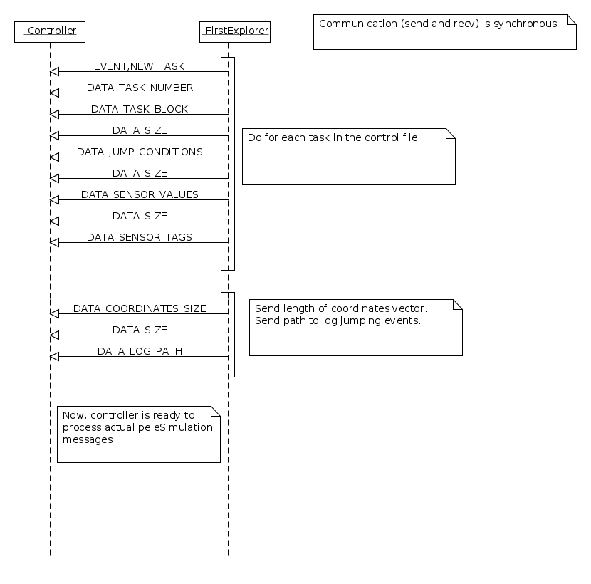
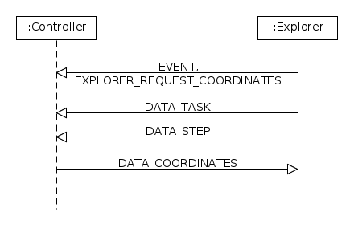
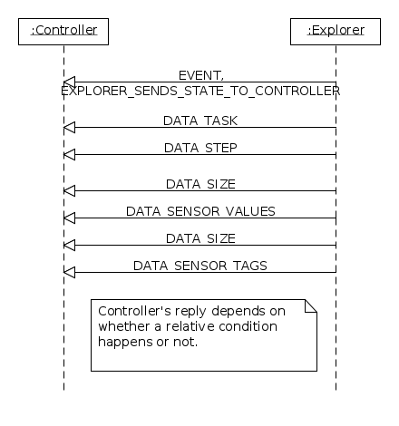
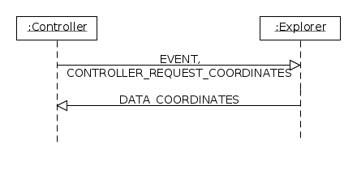
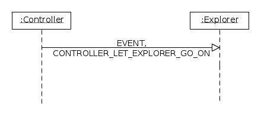
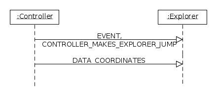
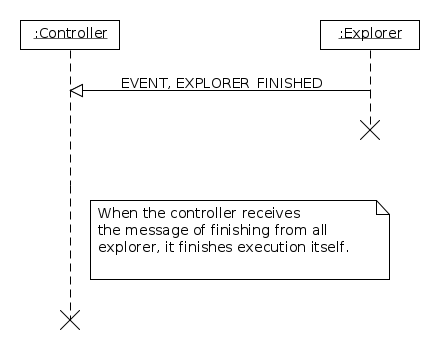
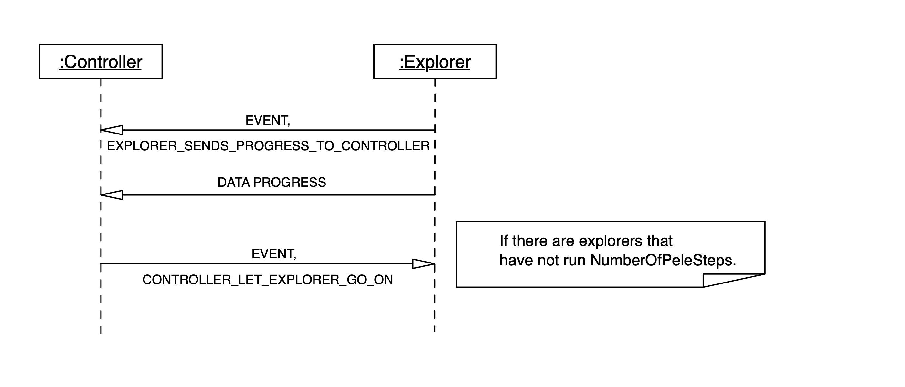
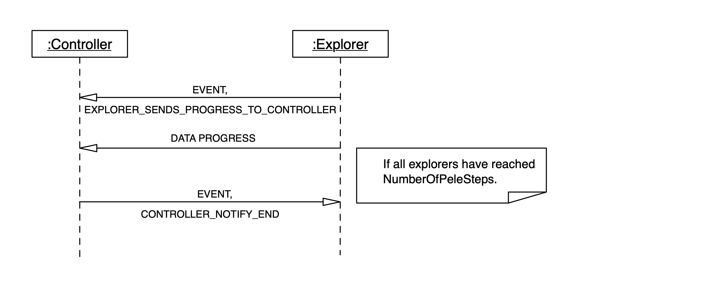

.. _sec-dev-mpiProtocol:

************
MPI Protocol
************

The process with rank 0 is the controller, and only coordinates all the other process. The other processes run PELE simulations. Each process gets its own random seed. For multicomplexes, each process gets also its own complex to study.

The controller runs the code of either an ``MpiBasicExplorationController`` object (when only jumping is allowed) or an ``MpiRealTimeControlExplorationController``, when real time control is allowed (see :ref:`sec-dev-realTimeControl`). All other other processes run ``PeleExplorer``.

Since both the ``MpiBasicExploratinoController`` and ``MpiRealTimeControlExplorationController`` share a large extent of the implementation, an ``MpiExplorationControllerHelper`` object exists implementing the common code. To simplify passing of arguments to that common code, the ``MpiExplorationJumpData`` class, of which the controller objects have a member variable, keeps the records for all the tasks, both of the ``JumpController`` objects, as well as the best explorer data and the current explorer data (notice this is highly coupled to the ``JumpController`` object, and the same current explorer data object must be used for all explorers of a given task). In the case of real time control, also the status of all explorers must be recorded.

In the case of serial exploration (a single process that acts both as controller and explorer), the ``SerialExplorationController`` is used. In this case, real time control is not yet implemented.

Besides the controller, there is a special explorer (that of rank 1), called the ``PeleMpiTools::FIRST_EXPLORER``. This first explorer is in charge, when building each task (in ``PeleTaskBuilder::createPeleTask()``) of sending information about the task to the controller (it is done in ``StateCommunicatorBuilder::createCommunicator()``, which calls ``createMpiCommunicator()`` for the MPI case and, after creation, calls ``StateCommunicator::sendTaskToExplorationController()``).

Notice that the state communicator is configured through dependency injection using a policy object for dealing with the jumping, and another policy object for dealing with the real time control. In the case of not having jumping nor real time control configured, for efficiency reasons, null policies are used in both cases. The classes implementing policies for both the MPI and serial versions (though the serial version is not yet fully implemented for real time control) are:

- ``NullCommandProcessor``
- ``NullJumpProcessor``
- ``SerialCommandProcessor``
- ``SerialJumpProcessor``
- ``MpiCommandProcessor``
- ``MpiJumpProcessor``

All possible messages (events) between the controller and the explorers are defined in the enumeration ``MPI_EVENTS``, and are:

- ``NEW_TASK``
- ``NO_MORE_TASKS``
- ``CONTROLLER_REQUEST_COORDINATES``
- ``EXPLORER_SENDS_STATE_TO_CONTROLLER``
- ``CONTROLLER_LET_EXPLORER_GO_ON``
- ``CONTROLLER_MAKES_EXPLORER_JUMP``
- ``EXPLORER_FINISHED``
- ``EXPLORER_REQUEST_COORDINATES``
- ``EXPLORER_SENDS_PROGRESS_TO_CONTROLLER``
- ``CONTROLLER_NOTIFY_END``
- ``EXPLORER_READY_FOR_COMMANDS``

The last message is only used when real time control is allowed, and is sent by each explorer just after finishing a step. 

The execution outline is:

- The controller does the control file validation and checks the license. The control file is peeked to decide whether to use real time control or not.
- The explorers read the control file (without validation). The first explorer sends all information about tasks to the controller, including information on the input/output files used for real time control (if this is not used, empty strings are sent).
- The controller reads all information about tasks from the first explorer, and then waits for explorer events (see above) and for real time commands.
- Once all explorers have finished, the controller finishes as well.

For helper functions for MPI is ``PeleMpiTools``.

Usage of the MPI standard
=========================

To simplify sending of structured data through MPI, MPI_Datatypes are used. This requires that, before using MPI, just after calling ``MPI_Init()``, ``PeleMpiTools::initializeDataTypes()`` must also be called. Besides, just before calling ``MPI_Finalize()``, ``PeleMpiTools::cleanupDataTypes()`` must be called.

The structure implemented as an MPI structure is ``PeleMpiTools::TaskStepNumber``.

Also, to use a single send for strings, these are sent as arrays of MPI_CHAR. This requires that, upon reception, first ``MPI_Probe`` is called, and then ``MPI_Get_count``, to get the size of the array.

Notice that all ``MPI_Send`` are blocking regarding the buffers, that is, they will return as soon as the data is deposited in the sending buffer (but may not have been received). The ``MPI_Recv`` is blocking and will not return until the data has actually been received.

Protocol
========

The protocol consists of three phases. In the first phase, the first explorer sends information from the control file to the controller, to initialize it. Then, all explorers do their job, and send the controller information about the PELE simulation. Finally, when each explorer goes finishing, they tell so to the controller, which finishes itself once all explorers have done so. If ``MinimumSteps`` is enabled when a explorer reaches the ``numberOfPelesteps``, it indicates this situation to the controller, but does not finish its execution, it continues running more steps until the controller reports that all the explorers reached the minimum steps.

During the second phase, commands may be received. In such a case, when each explorer has finished its step, it says is ready for a command. If there is a command pending, then the explorer receives the command, updates its step information to the controller, and executes the command, continuing with the simulation, unless it is a PAUSE command, in which case enters a command-only state. In that state, it executes commands until either the TERMINATE command is received, or the RESUME command is received.

Notice that, during normal execution, a CHANGE_PARAMETERS command may be recieved withouth first pausing. However, in order to help the user in understanding what is happening, it is better to follow the process PAUSE-CHANGE_PARAMETERS-RESUME.

In any case, after resuming execution, the automatic change of parameters (configured at the ``"parametersChanges"`` section of the control file) may also happen.

Key functions are ``MpiCommandProcessor::processCommands()`` and ``MpiCommandProcessor::processPause()``, which implemente the first command processing state and the second state (when a PAUSE command is received). All the command processing is started from ``PeleTask::afterStep()``.

Initialization phase
--------------------

The following sequence diagram shows the messages exchanged during the first phase. All tasks are created at the beginning of the execution of PELE, so all tasks are first sent by the first explorer to the controller, before the actual PELE simulation starts.

Once the information of all tasks has been sent to the controller, a final event ``NO_MORE_TASKS`` is sent from the first explorer to the controller, so that the simulation phase can start.

Simulation phase
----------------

During the simulation, and if real time control is not active, all communication is started by the explorers, and only if they accept a PELE step. There are two cases: a) they accept the step and an absolute metric forces it to jump; b) they accept the step and no absolute metric forces it to jump.

In the case of real time control, after each step, each explorer synchronizes with the controller and waits for a command (or NOOP if no command is available). While not all explorers have received the current command, all other explorers can still send events. This is implemented by non-blocking check of MPI messages: the controller checking if there is any command to send or event to process and, if no command or event have arrived, sleeping for a given amount of time.

In the case of having to jump because of an absolute metric, the exchange of messages is as follows:

When no absolute condition happens, the communication is as follows:

Then, there are three options: 

- Current explorer is the best explorer, so its coordinates are requested.
- No relative condition is satisfied, so there is no jump.
- A relative condition is satisfied, and the explorer is requested to jump to the best explorer coordinates.

In the first case, the communication is:

For the second case:

For the third:

In the case of having real time control of the simulation, the states during the simulation phase can be described as:

1. No command received. The controller waits for commands and events.
2. A command was received. The controller waits for all explorers to be ready for commands, and it also process any events. If the command was TERMINATE, it goes to state 3. If the command was a PAUSE, it goes to state 4. Otherwise, it goes again to state 1.
3. The controller waits for all explorers to terminate.
4. The controller waits for commands and sends them to active explorers. When the command is a RESUME and it has been sent to all active exporers, the controller enters state 1 again. If the command is a TERMINATE, it sends the command to all active explorers and goes to state 3.

Finishing phase
---------------

This is the sequence diagram for the finishing phase.

When ``MinimumSteps`` is enabled the controller checks after each step if the explorer must continue. This is the sequence diagram when some explorer has not reached the number of steps.

This is the sequence diagram when all explorers have reached the number of steps.

