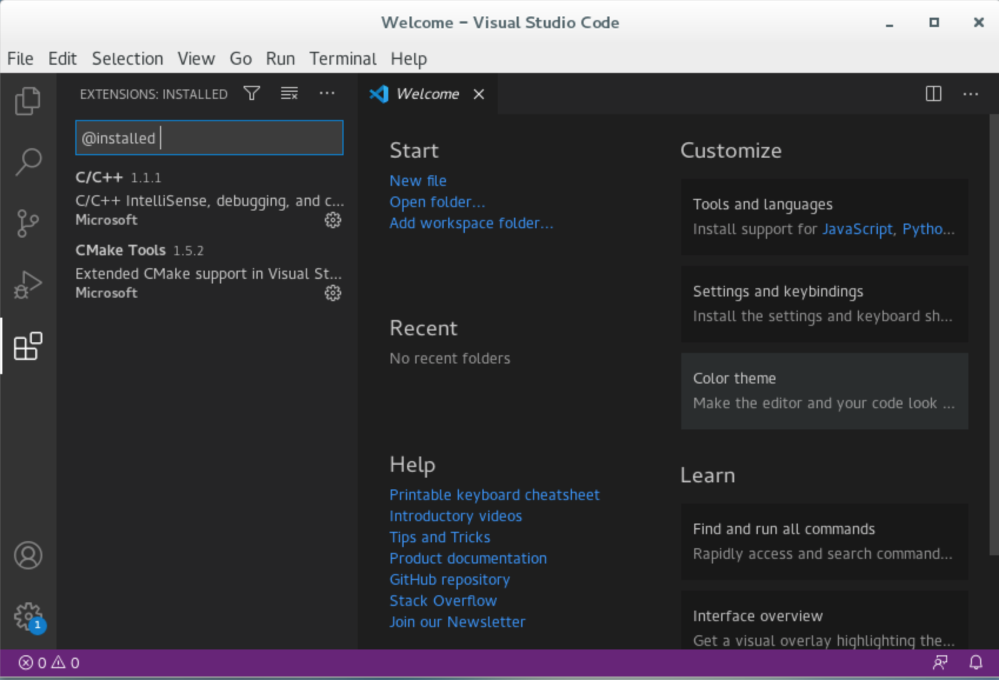
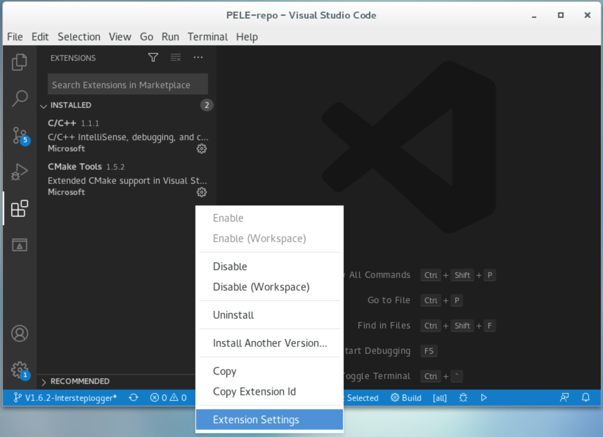
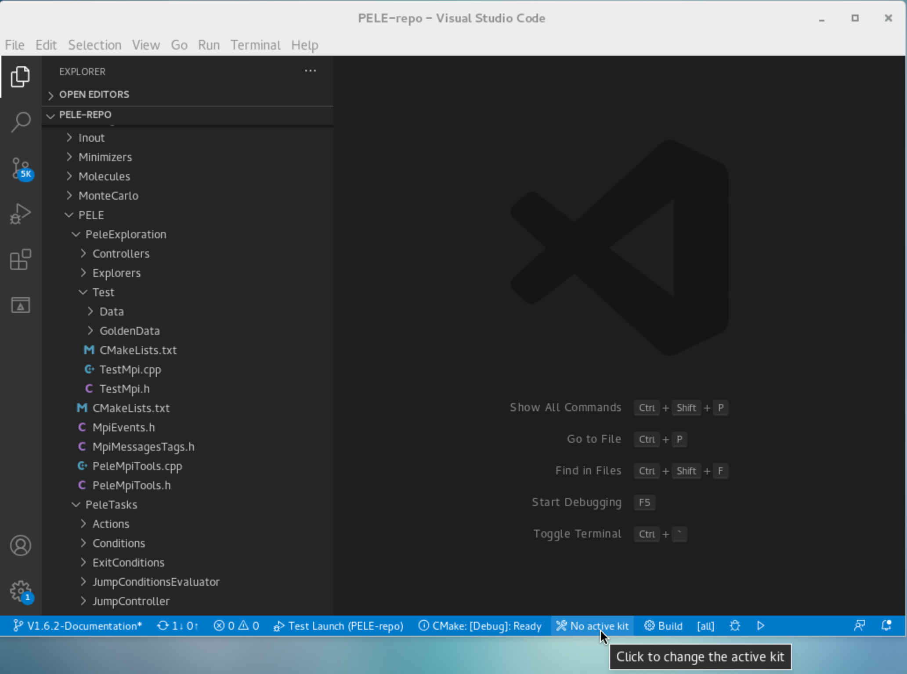
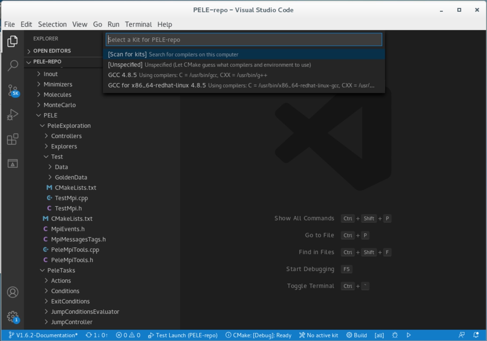
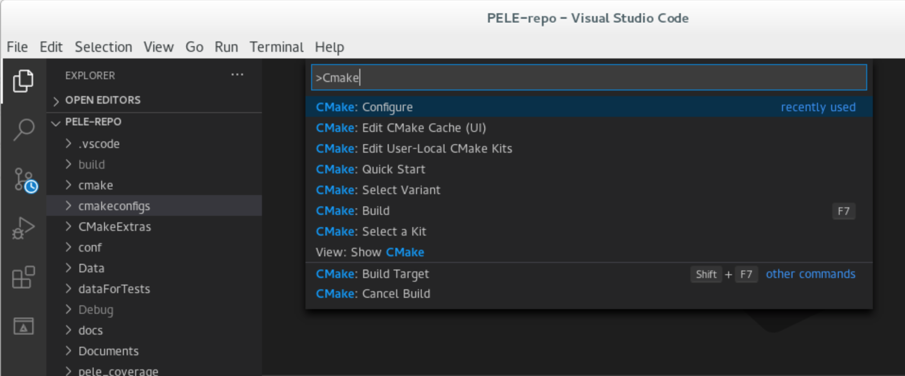

.. _sec-dev-quickStart:

***********************
Get started with coding
***********************

This tutorial will explain how to set up your machine to start coding with PELE.
The tutorial will be performed on NBD's office machine. However, feel free to adapt it to any linux system you may have.

Build PELE 
==========

Get source code
---------------

Latest source code is available on GitHub. You can get your own local copy by running the commnad below. 
If you do not have access please send an email to daniel.soler@nostrumbiodiscovery.com

	``git clone git@github.com:EAPM-BSC/PELE-repo.git``

Check dependencies
------------------

All dependencies for PELE can be found at NBD office machine under ``/shared/work/NBD_Utilities/PELE/PELE_dependencies/``, inside you will find the right version of cmake for compilation (3.15.0-rc1), and some dependency libraries you must have installed.

* Boost 1.52.0
* Licensecc https://github.com/open-license-manager/licensecc [-DUSE_LCC=ON]
* Crypto++ 5.6.5 (https://www.cryptopp.com/) [-DUSE_LCC=OFF]
* Jsoncpp 0.10.6
* Wjelement https://github.com/netmail-open/wjelement (uses an inhouse version, in https://github.com/NostrumBioDiscovery/wjelement)

Preparing the environment
-------------------------

To tell your machine the path of the previous dependencies, there are some cmake configuration files under ``PELE-repo/cmakeconfigs`` you may pass at runtime (check command below).

If everything is in place, check it works by manually building the project. To do this, run the next commands::

	cd PELE-repo
	mkdir build
	cd build
	/shared/work/NBD_Utilities/PELE/PELE_dependencies/cmake/bin/cmake -C ../cmakeconfigs/nbd.cmake ..
	make -j10

When the process finishes you should find the executable ``PELE-1.6`` under the build folder.

Working with Visual Studio Code
===============================

Visual Studio Code is available on NBD office machine. You can open in the menu option::

	Applications->Programming->Visual Studio Code

Or in console running the command::

	code

Installing extensions
---------------------

You can browse and install extensions from within VS Code. Bring up the Extensions view by clicking on the Extensions icon in the Activity Bar on the side of VS Code or the View: Extensions command (Ctrl+Shift+X). This will show a list of the most popular VS Code extensions on the VS Code Marketplace.

To use VS IDE with PELE it's necessary to install the following extensions:

* C/C++
* CMake Tools

Open and Preparing Project
--------------------------

Next, to compile PELE through VS, it is necessary to configure the following options from CMake Tools extension in **workspace settings**:

.. list-table::
   :widths: 100 400
   :header-rows: 1

   * - Option
     - Value
   * - Cmake: Cmake path
     - /shared/work/NBD_Utilities/PELE/PELE_dependencies/cmake/bin/cmake
   * - Cmake: Parallel Jobs
     - 10
   * - Cmake: Cache Init
     - cmakeconfigs/nbd.cmake

These settings are stored in workspace settings.json. You can see it with Command Palette (Ctrl+Shift+P) - *Preferences: Open Workspace Settings (JSON)*.

An example of settings.json is::

	{
		"cmake.cmakePath": "/shared/work/NBD_Utilities/PELE/PELE_dependencies/cmake/bin/cmake",
		"cmake.parallelJobs": 10,
		"cmake.cacheInit": "cmakeconfigs/nbd.cmake",
		"C_Cpp.default.configurationProvider": "ms-vscode.cmake-tools",
	}

Also select the **GCC 4.8.5** compilation kit by clicking on the status bar or with Command Palette (Ctrl+Shift+P) - *CMake: Select a kit*.

Building Project
-----------------

Once, all dependencies are set up and linked to VS, you can configure VS to automaticlly build the project. You can access all options through the Command Palette(Ctrl+Shift+P):

The main options are:

.. list-table::
   :widths: 200 500
   :header-rows: 1

   * - Command
     - Description
   * - *CMake: Configure*
     - Configure the project
   * - *CMake: Delete Cache and Reconfigure*
     - Clean configure: deletes the CMakeCache.txt file and CMakeFiles directory from the build directory. This resets all of CMake's default state
   * - *CMake: Edit CMake Cache (UI)*
     - View and edit CMake Cache variables and values
   * - *CMake: Build*
     - Build the project

Configure launch and debug
--------------------------

If you want to run PELE in debug mode within the IDE you need to configure the launch options (it is possible generate more than one configuration):

* (Ctrl+Shift+P) - *Debug: Open launch.json*

.. list-table::
   :widths: 100 200
   :header-rows: 1

   * - Option
     - Value
   * - "program"
     - ${workspaceFolder}/build/PELE-1.6

Example of An example of launch.json is::

	{
		// Use IntelliSense to learn about possible attributes.
		// Hover to view descriptions of existing attributes.
		// For more information, visit: https://go.microsoft.com/fwlink/?linkid=830387
		"version": "0.2.0",
		"configurations": [
			{
				"name": "Launch",
				"type": "cppdbg",
				"request": "launch",
				"program": "${workspaceFolder}/build/PELE-1.6",
				"args": ["--control-file",
					 	 "/home/user/run/Projects/samples/aspirin/control_file"],
				"stopAtEntry": false,
				"cwd": "/home/user/run/Projects/samples/aspirin",
				"environment": [],
				"externalConsole": false,
				"MIMode": "gdb",
				"setupCommands": [
					{
						"description": "Enable pretty-printing for gdb",
						"text": "-enable-pretty-printing",
						"ignoreFailures": true
					}
				],
				"miDebuggerPath": "/usr/bin/gdb"
			}
		]
	}

More information about VS Code
------------------------------

For more information on VS Code and how to use it, go to the official documentation page: https://code.visualstudio.com/docs/

