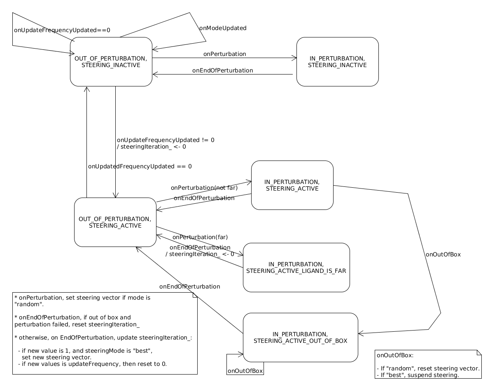

.. _sec-dev-steering:

********
Steering
********

PELE allows the ligand perturbation phase to be *steered*. This means that, once a given direction is accepted in the perturbation phase, for a number of PELE steps, that direction will be kept (allowing small deviations around the direction vector, following a Gaussian distribution). Notice that this only makes sense close to the receptor (this depends on the ``proximityDistance`` configuration property).

Steering is selected in the control file through the ``translationDirection`` property when set to ``steered``. Steering is then controlled through the parameter ``steeringUpdateFrequency``, which is a changeable parameter and, when set to zero, deactivates steering temporarily. You can control how the steering vector is selected through the parameter ``steeringMode``.

Setting the steering vector, and generating translation directions based on that vector is implemented by the ``GaussianDirectionGenerator`` class, which allows for a Gaussian distribution of generated vectors around the steering vector. An object of this class is controlled through another object of the class ``AtomSetMover``, which is itself controlled from ``Perturbation`` and its subclasses.

In order to implement this temporarily deactivation of the steering, the Publish/Subscribe system (see :ref:`sec-dev-publishSubscribe`) is used, so that a change in ``steeringUpdateFrequency`` allows ``Perturbation`` to reset (or activate/deactivate) steering. A change in the frequency (that does not deactivate steering) or in the steering mode, will restart the steering cycle, forcing to select a new steering vector.

When steering is deactivated, then an alternative direction generator is used (currently the only other option, ``random``). To allow for this activation and deactivation, ``AtomSetMover`` (which implements the ligand perturbation) keeps internally an active ``TranslationDirectionGenerator``, as well as it stores the originally chosen one, and the alternative one. Since they are stored as pointers, it is easy just changing from one to another. Notice that steering is also temporarily deactivated (suspended) when the atom set to perturb is too far from the receptor (see the ``proximityDistance`` configuration property); in such a case, after the perturbation phase, steering is again activated.

If steering is active, the steering vector is changed at the first perturbation step, and then every n steps, where n is the steering update frequency. If during steering a movement is generated that gets the perturbed atom set out of the box, then the steering vector is reset, and the counter too. When in the ``random`` steering mode, the vector is created at random before starting the perturbation in the first iteration; for the ``best`` steering mode, the perturbation in the first steering iteration is performed, and then the translation corresponding to that perturbation is chosen as the steering vector.

All the control of the steering state is done through the ``SteeringManager`` class. This keeps the said state, and also is subscribed to the changes in the ``steeringUpdateFrequency`` and ``steeringMode`` (through the callback member functions ``XXXUpdated(const Event &e)``) . When some of these parameters change, or when a given event happens during the perturbation (controlled in the ``Perturbation`` class and its subclasses), then an event processing member function of ``SteeringManager`` is called (those functions of name ``onXXX()``), changing the steering state, and performing any needed changes to the steering vector. The current interface of ``SteeringManager`` is:

- To get the steering state: ``getPerturbationState()``, ``getSteeringActivationState()``, ``getSteeringIteration()``.
- Callback functions to subscribed events: ``steeringModeUpdated()``, ``steeringUpdateFrequencyUpdated()``.
- Event processing functions: ``onPerturbation()``, ``onOutOfBox()``, ``onEndOfPerturbation()``, ``onUpdateFrequencyUpdated()``, ``onModeUpdated()``.

The steering state consists of the following:

- Whether the simulation is currently performing a perturbation, or is not (``SteeringManager::perturbationState_``).
- Whether steering is active or not and, if active, if it is temporarily ignored due to the ligand being far from the receptor, or if the steering may have been reset or needed to be reset because a perturbation constantly got out of the box (``SteeringManager::steeringActivationState_``).
- The current iteration in a steering cycle (``SteeringManager::steeringIteration_``). It starts counting at zero, and is incremented at the end of each perturbation phase; when it reaches the value of the update frequency, it is reset to zero.
- The current steering vector.
- The steering mode.
- The steering update frequency.

Not all combination of values for the different state components constitutes a valid state, and not all events are allowed in all states. The ones allowed are:

- ``OUT_OF_PERTURBATION, STEERING_INACTIVE``: ``onModeUpdated``, ``onUpdateFrequencyUpdated``, ``onPerturbation``.
- ``IN_PERTURBATION, STEERING_INACTIVE``: ``onEndOfPerturbation``.
- ``OUT_OF_PERTURBATION, STEERING_ACTIVE``: ``onModeUpdated``, ``onUpdateFrequencyUpdated``, ``onPerturbation``.
- ``IN_PERTURBATION, STEERING_ACTIVE``: ``onOutOfBox``, ``onEndOfPerturbation``.
- ``IN_PERTURBATION, STEERING_ACTIVE_LIGAND_FAR``: ``onEndOfPerturbation``.
- ``IN_PERTURBATION, STEERING_ACTIVE_OUT_OF_BOX``: ``onOutOfBox``, ``onEndOfPerturbation``.

See below the state diagram.

  State diagram for steering (SteeringManager).

Other key functions in implementing steering are:

- ``AtomSetMover::suspendSteeringIfPresent()``
- ``AtomSetMover::resumeSteeringIfPresent()``
- ``AtomSetMover::hasActiveSteering()``
- ``AtomSetMover::hasSteering()``
