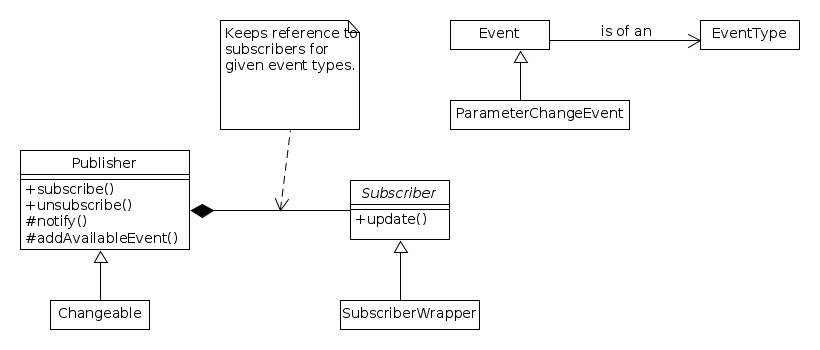

.. _sec-dev-publishSubscribe:

***************************
Publish/Subscribe subsystem
***************************

PELE implements a Publish/Subscribe system (the Observer pattern).

This system was added to allow connecting dependent classes through an indirect way. This avoids explicitly coding the dependencies and using, instead, a shared interface (the Publish/Subscribe interface) to mark all these dependencies. The first feature using the Publish/Subscribe system was the triggering of actions (such as enable or disable steering from the perturbation) upon a change in the steering vector update frequency.

The main elements of the implementation are:

- Publisher: Base class for all those classes that may emit events to subscribers.
- EventType: Type to classify events, so that subscribers can listen only to selected events.
- Event: Base class for the description of an event.

The class diagram of the implementation in PELE:

Subscribers can subscribe to a ``Publisher`` through the publisher's ``subscribe()`` method, and later unsubscribe through the ``unsubscribe()`` method. Subscription is for a given event type by a given subscriber. This allows identification when unsubscribing.

All Publishers should derive from the ``Publisher`` class. Upon construction, they should register the allowed events by calling ``addAvailableEvent()``. There is no corresponding ``remove...()`` since it is assumed the type of events served by a publisher is fixed during execution (and kept in the allowedEvents attribute).

The notification to subscribers is triggered by the publisher calling the ``notify()`` method.

The pairings between event types and subscribers is kept internally by the publisher.

Subscribers are actually components of other classes, and it is not expected to have derived classes, but to bind specific functions to the reception of events.

The object that wants to subscribe to an event creates a ``Subscriber`` object, and binds a function to the reception of a given type of event from a given subscriber. This is done with the use of the wrapper function ``subscribe(EventType, Publisher*, const SubscriberUpdateFunction&)``, which is declared in the same header as ``Subscriber``. To allow this binding, ``SubscriberWrapper`` is a subclass of ``Subscriber`` that stores the binding and the event type.

When an event happens, the ``Subscriber::update()`` method is called.

.. warning::

   Since it is the publishers who keep a reference of the subscribers, through shared pointers, it is very important that subscribers (actually, their owners) unsubscribe from the publishers before destruction. After unsubscribing, it is the ``Subscriber`` component owner the only one leaving with a reference to the ``Subscriber`` object, and it will then be destroyed when the owner is also destroyed, avoiding keeping dangling references to the bound callback function.

The following code shows how subscription should be done.

.. code-block:: c++

  class Perturbation {
    // ...
    boost::shared_ptr<Subscriber> steeringUpdateFrequencySubscriber;
  };

  Perturbation::Perturbation() {
    // ...

	this->steeringUpdateFrequencySubscriber
		= subscribe(PerturbationParameters::STEERING_VECTOR_UPDATE_FREQUENCY_SET,
				this->perturbationParameters,
				boost::bind(&Perturbation::steeringUpdateFrequencyUpdated,
						this, _1));

    // ...
  };

  Perturbation::~Perturbation()
  {

    // unsubscribe from the subscribed events
    this->perturbationParameters->unsubscribe(
            PerturbationParameters::STEERING_VECTOR_UPDATE_FREQUENCY_SET,
	    this->steeringUpdateFrequencySubscriber);
    // ...
  }
  

On the other hand, publishers should add code to show which events they publish (this is for making sure there is a match between publishers and subscribers), and they must add code to notify events. The following example shows this (``Changeable`` is a subclass of ``Publisher``):

.. code-block:: c++

  class PerturbationParameters : public Changeable
  { // ... };
  
  PerturbationParameters::PerturbationParameters()
	: Changeable()
  {
    // ...
	Publisher::addAvailableEvent(PerturbationParameters::STEERING_VECTOR_UPDATE_FREQUENCY_SET);
  }

  void PerturbationParameters::setSteeringVectorUpdateFrequency(double steeringVectorUpdateFrequency) {
    ParameterChangeEvent<double> event(PerturbationParameters::STEERING_VECTOR_UPDATE_FREQUENCY_SET,
		this->steeringVectorUpdateFrequency,
		steeringVectorUpdateFrequency);

    this->steeringVectorUpdateFrequency = steeringVectorUpdateFrequency;

    Publisher::notify(event);
  }

